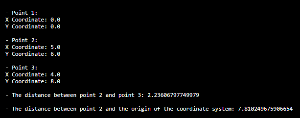

## Description
The Java program defines a Point class representing 2D Cartesian coordinates, offering methods for coordinate manipulation and distance calculation. In the main program, three points are created—either at the origin (0, 0) or with specified coordinates—and their details are displayed. The program calculates distances between points and showcases the basic functionality of the Point class for coordinate handling and distance computation in a 2D plane.
## Output

